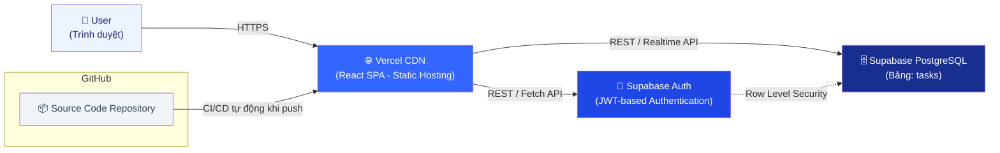

# Task & Asset Dashboard
### Hệ thống quản lý công việc và tài nguyên — Kiến trúc Cloud Serverless

---

## 1. Tóm tắt bài toán & Giải pháp

**Bài toán:** Xây dựng một ứng dụng web cho phép người dùng đăng nhập và quản lý danh sách công việc/tài sản (task) với đầy đủ trạng thái, mức ưu tiên, tìm kiếm, lọc và thao tác CRUD cơ bản (thêm/xóa).

**Giải pháp & lựa chọn kiến trúc:** Ứng dụng được xây dựng theo mô hình **Cloud Serverless (BaaS/PaaS)**, sử dụng:

- **Frontend:** React (Vite) + Tailwind CSS + Lucide Icons — build ra static assets, không cần server riêng.
- **Backend & Database:** Supabase — cung cấp sẵn Authentication, PostgreSQL Database và REST/Realtime API dưới dạng dịch vụ quản lý (managed service).
- **Hosting:** Vercel — CDN toàn cầu, auto-scale, CI/CD tích hợp sẵn với GitHub.

**Lý do chọn kiến trúc Serverless:**

| Tiêu chí | Lợi ích khi dùng Serverless (Vercel + Supabase) |
|---|---|
| **Chi phí** | Trả theo mức sử dụng thực tế (pay-as-you-go), có gói miễn phí đủ cho demo/MVP, không tốn chi phí vận hành server 24/7. |
| **Khả năng mở rộng** | Vercel tự động scale theo lưu lượng truy cập; Supabase (Postgres) scale theo nhu cầu mà không cần cấu hình hạ tầng thủ công. |
| **Tốc độ triển khai** | Không cần quản lý OS, container hay server — chỉ push code, CI/CD tự build & deploy trong vài phút. |
| **Bảo trì** | Không cần vá lỗi hệ điều hành, không cần quản lý uptime server — nhà cung cấp (Vercel/Supabase) chịu trách nhiệm hạ tầng. |
| **Bảo mật** | Supabase hỗ trợ sẵn Auth (JWT) và Row Level Security (RLS) ở cấp database, giảm rủi ro lộ dữ liệu chéo giữa người dùng. |

> **Lưu ý về chế độ chạy:** Để phục vụ demo cấp tốc khi chưa kịp cấu hình API Key, ứng dụng có cơ chế **tự động fallback sang LocalStorage** (xem mục 6) khi biến môi trường Supabase chưa được thiết lập — toàn bộ luồng nghiệp vụ (đăng nhập, CRUD, lọc, tìm kiếm) vẫn hoạt động đầy đủ ngay tại local, không cần internet.

---

## 2. Sơ đồ Kiến trúc Cloud (Cloud Architecture)



**Luồng hoạt động:**
1. Người dùng truy cập ứng dụng React (SPA) được phân phối qua **Vercel CDN** (edge network, tốc độ tải nhanh toàn cầu).
2. Khi đăng nhập, frontend gọi **Supabase Auth** để xác thực bằng email/password, nhận về JWT token.
3. Mọi thao tác CRUD với task được gửi tới **Supabase PostgreSQL** thông qua REST API tự sinh, được bảo vệ bởi **Row Level Security (RLS)** — đảm bảo mỗi user chỉ thấy dữ liệu của chính mình.
4. Khi có commit mới trên nhánh `main` của GitHub, **Vercel CI/CD** tự động build và triển khai bản mới.

---

## 3. Bảng Test Cases

| STT | Test Case | Bước thực hiện | Dữ liệu đầu vào | Kết quả mong đợi |
|---|---|---|---|---|
| TC-01 | Đăng nhập thành công | Nhập email/mật khẩu hợp lệ → Nhấn "Đăng nhập" | `admin@demo.com` / `123456` | Chuyển vào màn hình Dashboard, hiển thị tên/email user ở header |
| TC-02 | Đăng nhập thất bại — sai mật khẩu | Nhập email đúng, mật khẩu sai → Nhấn "Đăng nhập" | `admin@demo.com` / `sai123` | Hiển thị thông báo lỗi "Email hoặc mật khẩu không chính xác", không chuyển trang |
| TC-03 | Validate form đăng nhập | Để trống email, nhấn "Đăng nhập" | email rỗng | Hiển thị lỗi "Vui lòng nhập email", không gọi API |
| TC-04 | Thêm công việc mới thành công | Nhấn "Thêm công việc" → điền đầy đủ form hợp lệ → Lưu | Title, Assignee, Due Date hợp lệ | Task mới xuất hiện đầu danh sách, Summary Card "Tổng số công việc" +1 |
| TC-05 | Validate form thêm task | Nhấn "Thêm công việc" → để trống "Tên công việc" → Lưu | title rỗng | Hiển thị lỗi dưới field, modal không đóng, task không được tạo |
| TC-06 | Lọc dữ liệu theo trạng thái | Chọn bộ lọc "Done" | statusFilter = Done | Bảng chỉ hiển thị các task có trạng thái Done, Card thống kê không đổi |
| TC-07 | Tìm kiếm công việc | Nhập từ khóa vào ô tìm kiếm | VD: "Supabase" | Bảng chỉ hiển thị các task có tiêu đề/người phụ trách chứa từ khóa |
| TC-08 | Xóa công việc | Nhấn nút "Xóa" trên 1 dòng task | id task hợp lệ | Task biến mất khỏi bảng ngay lập tức, Summary Card cập nhật lại số liệu |

---

## 4. Cấu trúc thư mục

```
task-asset-dashboard/
├── src/
│   ├── components/
│   │   ├── SummaryCards.jsx      # 4 thẻ thống kê tổng quan
│   │   ├── SearchFilter.jsx      # Thanh tìm kiếm + lọc trạng thái + nút thêm mới
│   │   ├── TaskTable.jsx         # Bảng danh sách task (badge trạng thái/ưu tiên)
│   │   └── TaskModal.jsx         # Modal form thêm task có validate
│   ├── pages/
│   │   ├── Login.jsx             # Màn hình đăng nhập
│   │   └── Dashboard.jsx         # Màn hình chính, gắn kết toàn bộ component
│   ├── context/
│   │   └── AuthContext.jsx       # Quản lý phiên đăng nhập (Supabase hoặc local)
│   ├── utils/
│   │   ├── supabaseClient.js     # Khởi tạo Supabase client (nếu có API key)
│   │   ├── taskService.js        # Lớp trừu tượng CRUD (Supabase hoặc localStorage)
│   │   └── storage.js            # Fallback localStorage cho Auth & Tasks
│   ├── data/
│   │   └── mockData.json         # 20 bản ghi task mẫu
│   ├── App.jsx
│   ├── main.jsx
│   └── index.css
├── supabase/
│   └── schema.sql                # Script tạo bảng "tasks" + RLS Policy
├── .env.example
├── index.html
├── tailwind.config.js
├── postcss.config.js
├── vite.config.js
├── package.json
└── README.md
```

---

## 5. Cài đặt & Chạy ứng dụng tại Local

```bash
# 1. Di chuyển vào thư mục dự án
cd task-asset-dashboard

# 2. Cài đặt dependencies
npm install

# 3. (Tuỳ chọn) Cấu hình Supabase — nếu bỏ qua, app tự chạy chế độ demo cục bộ
cp .env.example .env
# Mở .env và điền VITE_SUPABASE_URL, VITE_SUPABASE_ANON_KEY

# 4. Chạy ứng dụng ở môi trường development
npm run dev
# Ứng dụng chạy tại http://localhost:5173

# 5. Build bản production
npm run build

# 6. Xem thử bản build production
npm run preview
```

**Tài khoản đăng nhập demo (chế độ local, không cần Supabase):**
- Email: `admin@demo.com`
- Mật khẩu: `123456`

---

## 6. Cấu hình Supabase (Backend thật, tuỳ chọn)

1. Tạo project mới tại [supabase.com](https://supabase.com).
2. Vào **SQL Editor**, chạy nội dung file `supabase/schema.sql` để tạo bảng `tasks` cùng chính sách RLS.
3. Vào **Authentication > Users**, tạo thử 1 user bằng email/password để đăng nhập.
4. Vào **Project Settings > API**, lấy `Project URL` và `anon public key`, dán vào file `.env`.
5. Khởi động lại `npm run dev` — ứng dụng sẽ tự động chuyển sang dùng Supabase thay vì localStorage (header Dashboard hiển thị "Cloud (Supabase)").
6. (Tuỳ chọn) Import 20 bản ghi trong `src/data/mockData.json` vào bảng `tasks` qua **Table Editor > Insert > Import data from JSON**.

---

## 7. Hướng dẫn Triển khai (Deployment Guide)

### Bước 1 — Đẩy code lên GitHub

```bash
git init
git add .
git commit -m "Initial commit: Task & Asset Dashboard"
git branch -M main
git remote add origin https://github.com/<username>/task-asset-dashboard.git
git push -u origin main
```

### Bước 2 — Triển khai lên Vercel

1. Đăng nhập [vercel.com](https://vercel.com) bằng tài khoản GitHub.
2. Chọn **Add New... > Project**, import repository `task-asset-dashboard` vừa push.
3. Vercel tự nhận diện đây là dự án **Vite** — giữ nguyên cấu hình mặc định:
   - Build Command: `npm run build`
   - Output Directory: `dist`
4. Trong mục **Environment Variables**, thêm (nếu dùng Supabase thật):
   - `VITE_SUPABASE_URL`
   - `VITE_SUPABASE_ANON_KEY`
5. Nhấn **Deploy**. Sau 1–2 phút, Vercel cấp một domain dạng `https://task-asset-dashboard.vercel.app`.
6. Mỗi lần `git push` lên nhánh `main`, Vercel tự động build & deploy lại (CI/CD).

---

## 8. Công nghệ sử dụng

| Thành phần | Công nghệ |
|---|---|
| Frontend Framework | React 18 + Vite |
| Styling | Tailwind CSS |
| Icon | Lucide React |
| Backend/DB (Cloud) | Supabase (Auth + PostgreSQL) |
| Fallback local | LocalStorage (Mock Service) |
| Hosting/CDN | Vercel |
| Kiến trúc | Serverless / BaaS |
